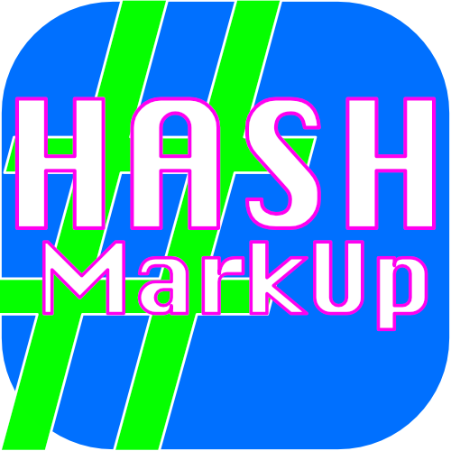

<p align="center">
  
</p>

# Hash Markup

Cross-platform (macOS + Windows) desktop Markdown editor with both a true
WYSIWYG mode and a raw-markdown mode. Built on Electron + React +
TypeScript, with [Toast UI Editor](https://ui.toast.com/tui-editor) as the
editor core.

## Features

- **WYSIWYG mode**: rich editing with a full formatting toolbar
  (headings, bold/italic/strike, lists, task lists, tables, images,
  links, code blocks, quotes).
- **Markdown mode**: raw markdown with syntax highlighting.
- **Instant toggle**: ⌘/Ctrl+/ swaps modes; content stays in sync.
- **Folder sidebar**: browse a workspace of markdown files.
- **Recent files**, **export to PDF**, **spell-check toggle**,
  **light/dark/auto theme**, all persisted.
- **Native menus** and keyboard shortcuts (⌘N/O/S/⇧S/W).
- **Secure defaults**: context isolation, sandbox, strict CSP.

## Architecture

```
src/
  shared/            IPC contract (channels + types)
  main/              Electron main process
    Application (index.ts)
    AppWindow        secure BrowserWindow defaults
    MenuBuilder      native menu + recent/theme submenus
    FileManager      open/save dialogs + file I/O
    FolderService    folder tree for the sidebar
    RecentFiles      persisted preferences (electron-store)
    PdfExporter      markdown -> HTML -> printToPDF
    IpcRouter        wires channels to services
  preload/           context-isolated API bridge
  renderer/src/
    services/        DocumentModel + DocumentController
    hooks/           useDocument, React bridge to the model
    components/      MarkdownEditor (Toast UI), Toolbar, Sidebar
    App.tsx          wires it all together
```

## Prerequisites

- **Node.js 20.x or later** (Electron 30 + Vite 5 require modern Node).
- **npm** (ships with Node).
- **git**.
- No native-module toolchain needed. There are no `node-gyp`
  dependencies, so you do not need Xcode Command Line Tools, Visual
  Studio Build Tools, Python, etc. A clean Node install is enough.

On Windows, enable long-path support if you run into
`ENAMETOOLONG`-style errors during `npm install`:
`git config --system core.longpaths true` (run once, as admin).

## Build from source

The "don't trust my binaries, build your own" path:

```bash
git clone https://github.com/dtsoden/hash-markup.git
cd hash-markup
npm install
npm run package:mac   # on macOS
# or
npm run package:win   # on Windows
```

Artifacts land in `release/`.

## Scripts

| Script | What it does |
| --- | --- |
| `npm run dev` | Start the dev server (hot reload, devtools enabled). |
| `npm run build` | Compile main/preload/renderer to `out/` without packaging. |
| `npm start` | Preview the production build without packaging. |
| `npm run typecheck` | Run TypeScript in no-emit mode across node + web tsconfigs. |
| `npm run package:mac` | `build` + electron-builder, produces `.dmg` and `.zip`. |
| `npm run package:win` | `build` + electron-builder, produces NSIS installer and portable `.exe`. |
| `npm run package:all` | Both mac and win targets (only useful on macOS hosts). |

## Platform support

### macOS
- Current build target: **arm64 only** (Apple Silicon).
- Minimum macOS: 10.15 Catalina (Electron 30 requirement).
- **Intel Macs are not supported by the pre-built artifacts.** Intel
  Macs cannot run arm64 binaries (there is no reverse Rosetta). If you
  need Intel support, change `build.mac.target` in `package.json` to
  include `"x64"` or `"universal"` and rebuild.

### Windows
- Current build target: **x64 only**, pinned in `package.json` under
  `build.win.target`.
- Minimum Windows: 10. Runs on 11.
- ARM64 Windows users: install via an x64 build (Windows on ARM runs
  x64 under emulation) or add `"arm64"` to the target arch list and
  rebuild.

### Linux
Not currently packaged. `electron-builder` supports Linux targets
(AppImage, deb, rpm, snap) if you want to extend `package.json`.

## Signing and trust

Self-built Windows installers are **not code-signed**. On first run,
SmartScreen will show a "Windows protected your PC" prompt. This is
expected for any unsigned executable. Click **More info** > **Run
anyway**.

The Mac build is also unsigned and unnotarized. Gatekeeper will refuse
to open it on first launch; right-click the app and choose **Open** to
override, or run `xattr -d com.apple.quarantine /Applications/Hash\
Markup.app` after installing.

If you distribute your own fork, code-signing (Authenticode on
Windows, Developer ID + notarization on macOS) is strongly recommended.

## License

MIT. See `package.json`.
